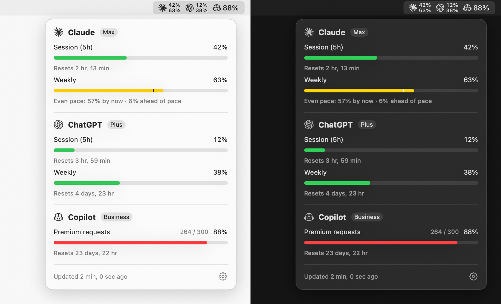

# Agents Usage Monitor

A tiny macOS menu bar app showing current plan usage for **Claude**, **ChatGPT** and **GitHub Copilot**.

<p align="center"></p>

- The menu bar shows the most-used limit per provider next to an icon for each service.
  Plans with both a 5h session and weekly limits show both, stacked (session on top, weekly below).
- Click it for per-window details: session/weekly/monthly limits, plan, and reset times.
- Hover a usage bar to see the **even-pace** marker — where you'd be if you spread usage evenly over the window — and whether you're ahead of or under pace.
- Choose which providers to show from the gear menu (**Show**), and drag sections in the panel to reorder them; the menu bar follows the same order.
- Refreshes every 5 minutes. Last known values are kept across restarts, and at launch a provider is only fetched if its saved values are older than 5 minutes or a limit has reset since.
- If an API is rate limited, the last known values stay visible with a ⚠︎ next to them, and the app waits as long as the `Retry-After` header asks before calling that provider again.

<sub>Screenshot (light and dark mode) uses sample data.</sub>

## Requirements

macOS 14+, Swift 6 toolchain. It reuses existing CLI logins — no extra credentials are stored:

| Provider | Credential source | Endpoint |
|----------|-------------------|----------|
| Claude   | Claude Code OAuth token in the keychain (`claude` login) | `api.anthropic.com/api/oauth/usage` |
| ChatGPT  | Codex CLI login (`~/.codex/auth.json`, or `$CODEX_HOME`) | `chatgpt.com/backend-api/wham/usage` |
| Copilot  | `gh auth token` (or `$GITHUB_TOKEN`) | `api.github.com/copilot_internal/user` |

These are undocumented endpoints and may change. If a token expires, re-run the respective CLI.

## Build & install

```sh
./scripts/build-app.sh            # builds build/AgentsUsageMonitor.app
./scripts/build-app.sh --install  # copies to /Applications and launches
swift test                        # parser tests
```

Open at Login is enabled on first run. Refresh, Open at Login and Quit live in the gear menu at the bottom of the panel.

## Credits

Brand icons from [Simple Icons](https://simpleicons.org) (CC0). Logos are trademarks of their respective owners.
